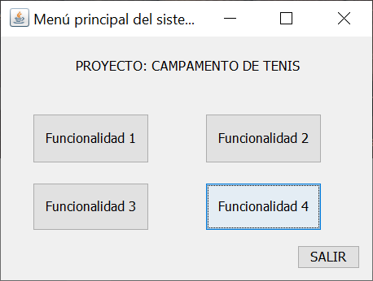
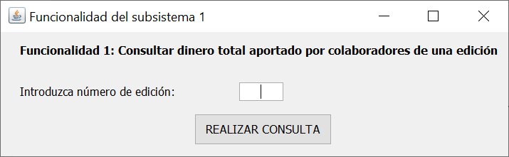
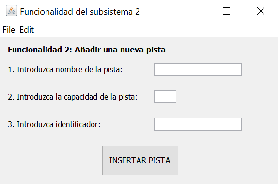
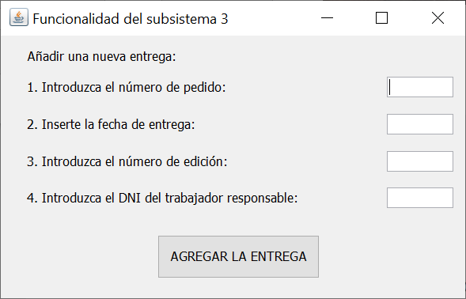
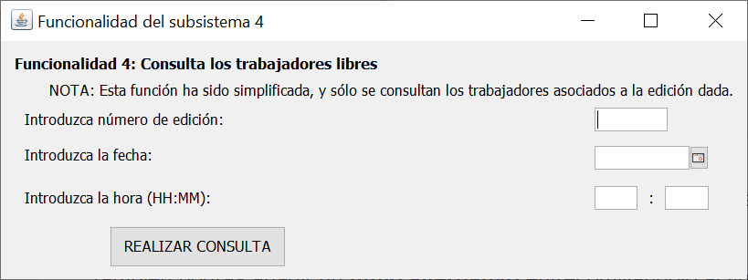

# Proyecto

## ¿Cómo probar la app usando la GUI?

Precondiciones:
0. Usar el IDE Netbeans (es con el que se ha desarrollado la app).
1. Crear una base de datos relacional.
2. Usar el script `implementacion_final.sql` (adaptándolo a cada SGBD donde sea necesario) para generar las tablas, rellenarlas y crear los disparadores. En este script, además, hay algunas sentencias `INSERT` que "provocan" el lanzamiento de los disparadores.  
3. Modificar el código de la clase `Consultas.java` para establecer la conexión a la base de datos que vayas a usar. Sólo hay que modificar el método `initialize()` cambiando el host, el nombre de la BD, user y password. El método es:

~~~
public void initialize() throws Exception {
    DriverManager.registerDriver( new oracle.jdbc.driver.OracleDriver());

    String cadenaConexion = "jdbc:oracle:thin:@host:port/nombre_bd" ;
    String user = "user"; 
    String pass = "pass"; 

    conn = DriverManager.getConnection (cadenaConexion, user, pass);

    System.out.println("Conexion a la base de datos establecida");

}
~~~

4. Constuir el fichero `JAR` de la aplicación. 
5. Ejecutar el `JAR`, y abrirá la ventana principal de la app:

En esa ventana principal, ya podremos acceder a las funcionalidades implementadas (una funcionalidad por cada subsistema asignado al grupo):

* Ventana de la función del Subsistema 1:

* Ventana de la función del Subsistema 2:

* Ventana de la función del Subsistema 3:

* Ventana de la función del Subsistema 4:

## Sobre la "calidad" de este proyecto
Este proyecto fue calificado con un 9,5 sobre 10 en Convocatoria Ordinaria.
